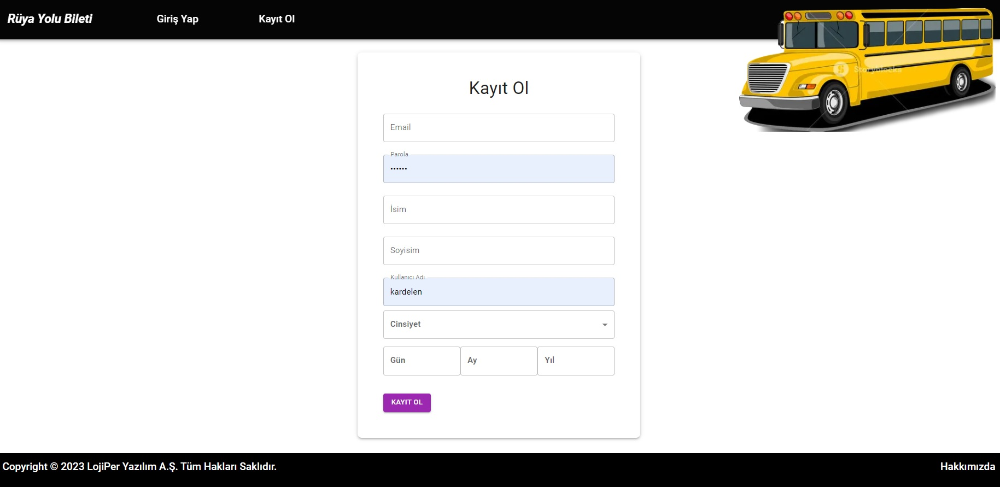
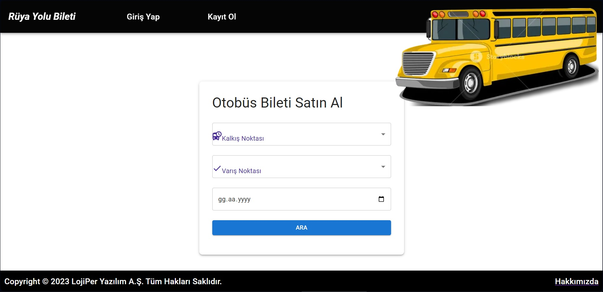
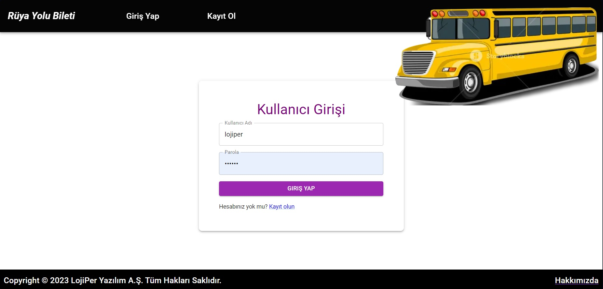
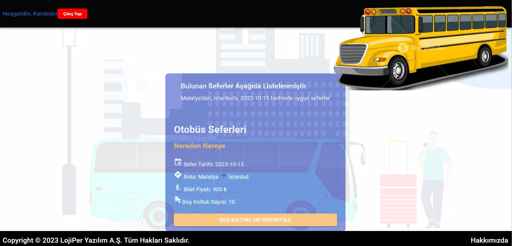
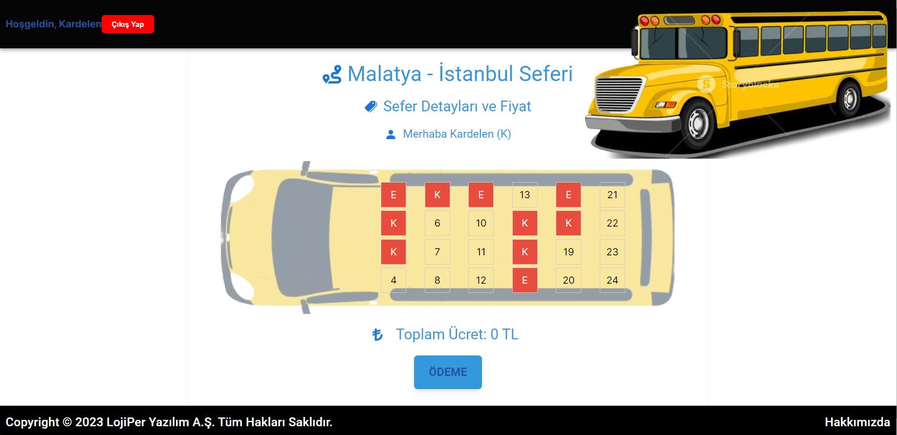
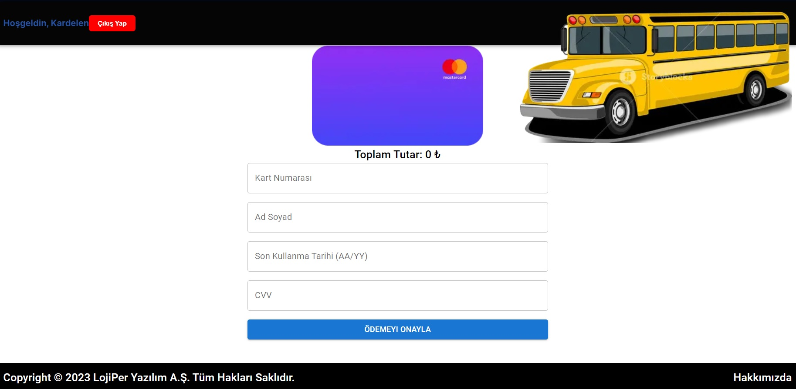
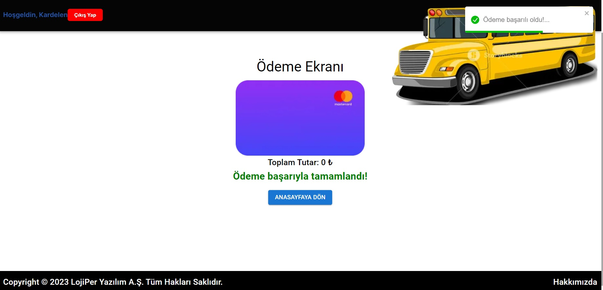

## LOJİPER TASK

### Açıklama

Lojiper için hazırlanmış "Otobüs Bileti Satın Alma Uygulaması" nı içermektedir.

### Proje Bilgisi

Kullanıcıların otobüs bileti satın almak için kullanabilecekleri bir arayüz tasarımını içermektedir. Kullanıcılar kayıt olmadan seyahat edecekleri yerlerin bilgisini alabilirler. Kayıt olunduktan sonra biletlerini satın alabilecekleri bir arayüzü içerir.

### Kurulum

- Projeyi klonlayın.

git clone    https://github.com/sertacgltkn/lojiper-task.git

### Projeyi çalıştırma
Terminalde aşağıdaki kodları sırasıyla giriniz.

 npm install   >>> Projenin modüllerini yüklemek için gerekli npm kodu

 npm run dev  >>> Projeyi başlatmak için gerekli npm kodu

### Projede Kullanılan Teknolojiler

- Next.js
- TypeScript
- Material UI
- Axios
- React Toastify

### Kullanıcılar

username: lojiper
password: 123456

username: sertacgltkn
password: 123456

username: kardelen
password: 123456

### Proje Görselleri

